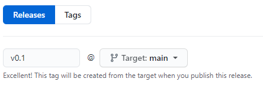

# Tarea 4. Refuerzo GitHub

1. Crear un repositorio.

    

2. Clonar repositorio.

    ```bash
    $ git clone https://github.com/edumarrom/refuerzo-emr.git
    ```
    

3. Readme

    

4. Commit Inicial.

    ```bash
    $ git add .
    $ git commit -m "Commit inicial"
    ```

5. Push inicial.

    ```bash
    $ git push
    ```
6. Ignorar archivos.
    1. Crea en el repositorio local un fichero llamado privado.txt
        ```bash
        $ echo "" > privado.txt
        ```
    2. Crea en el repositorio local una carpeta llamada privada
        ```bash
        $ mkdir privada
        ```
    3. Realiza los cambios oportunos para que tanto el archivo como la carpeta sean ignorados por git.
        ```bash
        $ echo "privado.txt" > .gitignore
        $ echo "privado/" >> .gitignore
        ```

7. Añadir fichero.

    ```bash
    $ echo "" > 1.txt
    ```

8. Crear tag.

    

9. Subig tag.
