# Entornos de Desarrollo: Tarea 5. Refuerzo GitHub (II)
### Eduardo Martínez Romero - 1º DAW 2020·2021

1. Crear rama
    ```bash
    $ git branch v0.2
    ```
2. añadir fichero.

    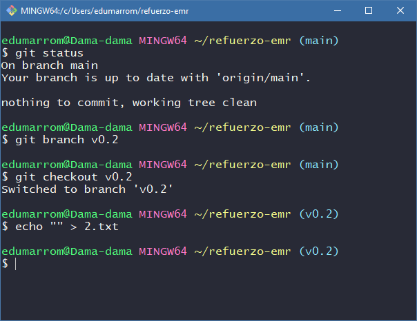

3. crear rama remota.

    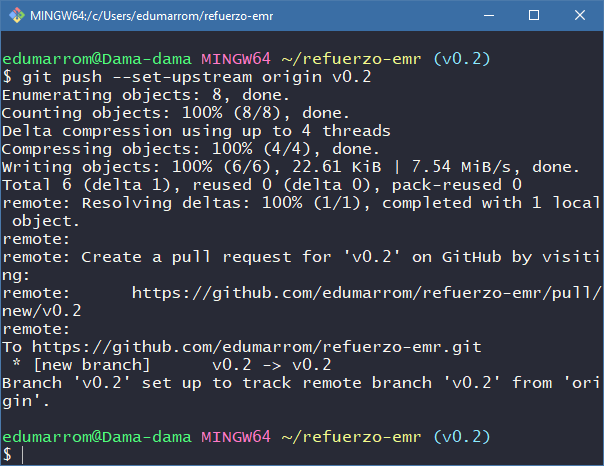

4. Merge directo.
    1. Posicionarse en la rama maestra.
        ```bash
        $ git checkout main
        ```
    2. Hacer un merge de la rama v0.2 en la rama master.
        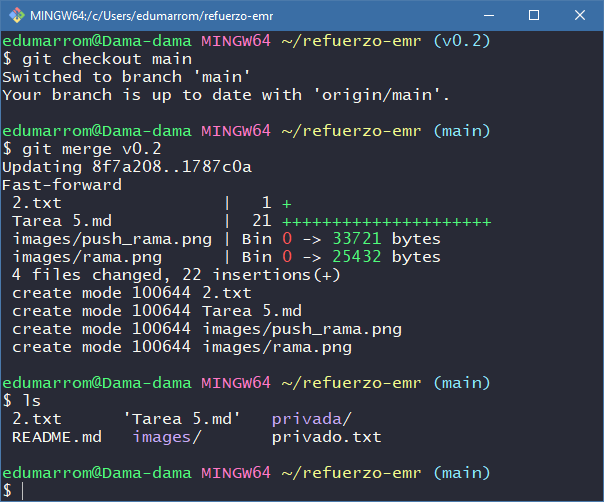

5. Merge con conflicto.
    1. En la rama master poner “Hola” en el fichero 1.txt y hacer commit.
        ```bash
        $ echo "Hola" > 1.txt
        $ commit -am "Hola main/1.txt"
        ```
    2. Posicionarse en la rama v0.2 y poner “Adios” en el fichero “1.txt” y hacer commit.
        ```bash
        $ git checkout v0.2
        $ echo "Adios" > 1.txt
        $ commit -am "Adios v0.2/1.txt"
        ```
        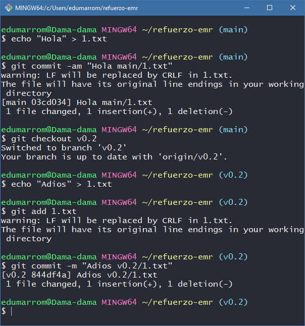

    3. Posicionarse de nuevo en la rama master y hacer un merge con la rama v0.2.

        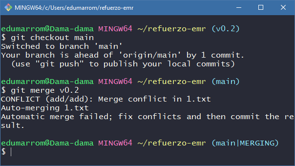

6. Listado de ramas.

    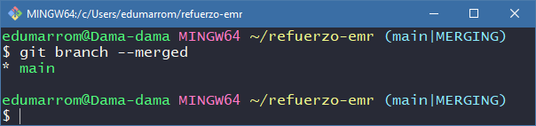

7. Arreglar conflicto.

    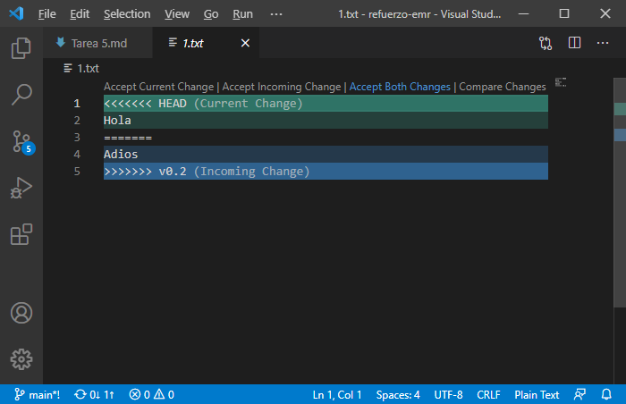
    Hemos aceptado ambos cambios. El resultado es:

        Hola
        Adios

    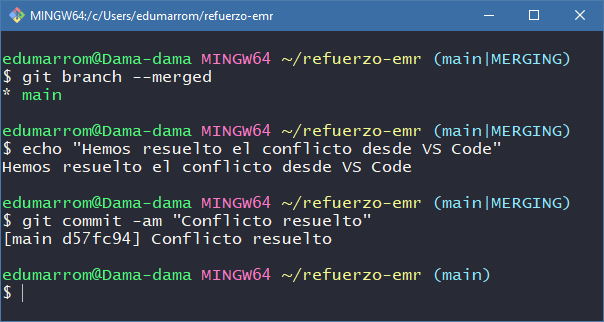

8. Borrar rama.
    1. Crear un tag v0.2

        ```bash
        $ git tag v0.2
        ```

    2. Borrar la rama v0.2

        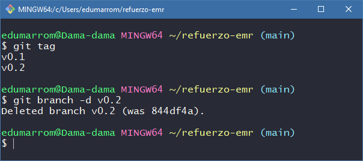

9. Lista los distintos commits con sus ramas y sus tags

    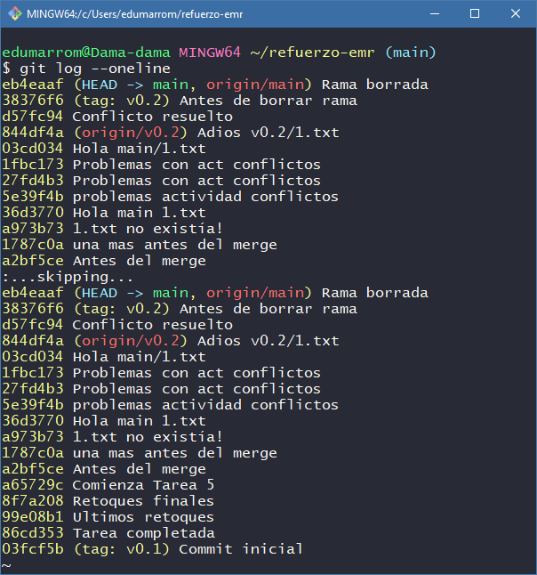

10. Crear organización.

    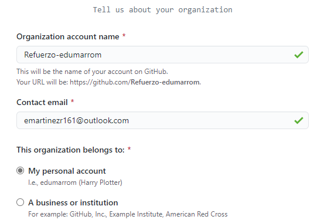

11. Crear equipos.

    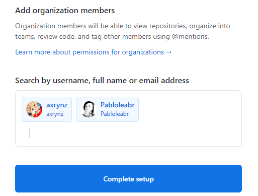

    1. Crea dos equipos en la organización refuerzo-edumarrom, uno llamado administradores con más permisos y otro colaboradores con menos permisos.

        

        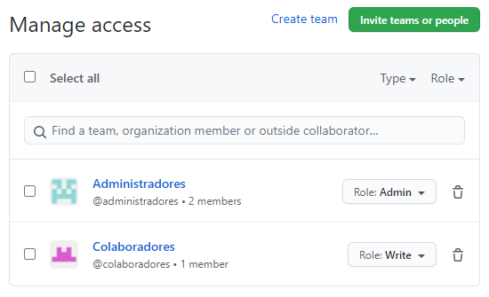

    2. Meter a github.com/antvazcar y a 2 de vuestros compañeros del grupo de clase en el equipo administradores

        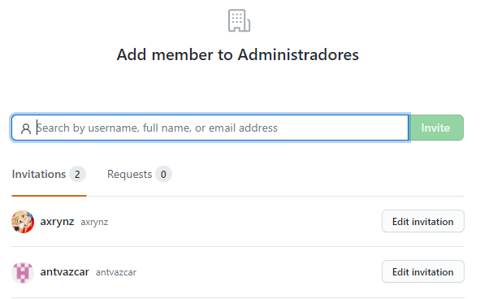

    3. Meter a github.com/antvazcar y a otros 2 compañeros del grupo de clase en el equipo colaboradores

        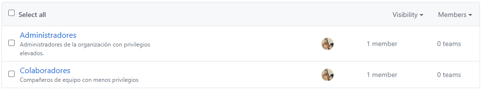

12. Crea un index.html.

    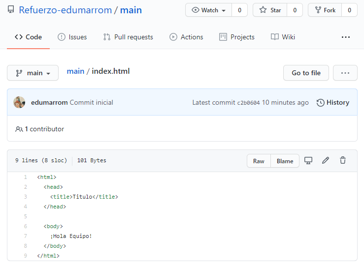
